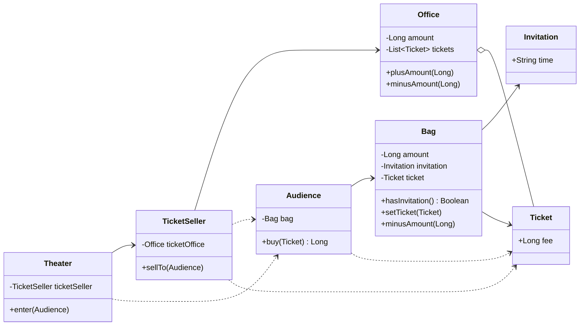

```mermaid
classDiagram
    direction LR
    class Audience {
        -Bag bag
        +buy(Ticket) Long
    }
    Audience --> Bag
    Audience ..> Ticket

    class Bag {
        -Long amount
        -Invitation invitation
        -Ticket ticket
        +hasInvitation() Boolean
        +setTicket(Ticket)
        +minusAmount(Long)
    }
    Bag --> Invitation
    Bag --> Ticket

    class Office {
        -Long amount
        -List~Ticket~ tickets
        +plusAmount(Long)
        +minusAmount(Long)
    }
    Office o-- Ticket

    class TicketSeller {
        -Office ticketOffice
        +sellTo(Audience)
    }
    TicketSeller --> Office
    TicketSeller ..> Audience
    TicketSeller ..> Ticket

    class Invitation {
        +String time
    }
    class Ticket {
        +Long fee
    }
    class Theater {
        -TicketSeller ticketSeller
        +enter(Audience)
    }
    Theater --> TicketSeller
    Theater ..> Audience
```
