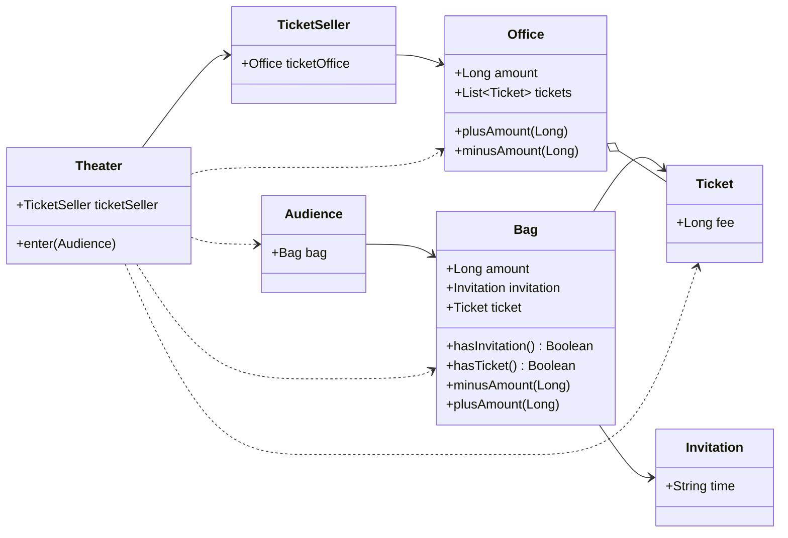

```mermaid
classDiagram
    direction LR
    class Audience {
        +Bag bag
    }
    class Bag {
        +Long amount
        +Invitation invitation
        +Ticket ticket
        +hasInvitation() Boolean
        +hasTicket() Boolean
        +minusAmount(Long)
        +plusAmount(Long)
    }
    class Office {
        +Long amount
        +List~Ticket~ tickets
        +plusAmount(Long)
        +minusAmount(Long)
    }
    class TicketSeller {
        +Office ticketOffice
    }
    class Invitation {
        +String time
    }
    class Ticket {
        +Long fee
    }
    class Theater {
        +TicketSeller ticketSeller
        +enter(Audience)
    }
    Audience --> Bag
    Bag --> Invitation
    Bag --> Ticket
    Office o-- Ticket
    TicketSeller --> Office
    Theater --> TicketSeller
    Theater ..> Audience
    Theater ..> Bag
    Theater ..> Office
    Theater ..> Ticket

```
